# Touch — Content production

> Source content for [`../../../projects/content-production.html`](../../../projects/content-production.html). Structure follows [`../../../project-page-structure.md`](../../../project-page-structure.md). Slug: `content-production`.

**Client · Domain · Type · Years:** Tinkoff · FinTech · Marketing automation · Web app · 2026

**Lead:** Shaped a product vision for Content Hub inside Touch: one workspace where marketers, editors, designers, and technologists can create, review, version, test, and reuse campaign creatives without losing context across Jira, chats, Figma, Google Docs, and legacy constructors.

<!-- FIGURE: Hero - use `00 oreview.png`. Canvas for the Transfers campaign with role tools, AI assistant, and approval controls. -->

*Content Hub canvas - a shared creative workspace with campaign context, AI-assisted image generation, and role-based approval controls.*

## Highlights snapshot

| Label | Value |
|-------|-------|
| **◆ Context** | Touch - internal CVM / marketing automation platform for financial services |
| **◆ Task** | Define the future workflow for content production inside Touch and validate it with Editors, Designers, and Technologists |
| **◆ Goal** | Reduce campaign time-to-launch by keeping briefs, creative assets, review history, role approvals, and testing inside one campaign context |
| **◆ Constraints** | Regulated financial communications; multiple creator roles; custom and template-based creative formats; transition period with Jira, Figma, chats, and existing constructors |
| **◆ Role** | Product Design Lead - vision framing, UX architecture, stakeholder alignment, critique synthesis, validation plan |
| **◆ Team** | Product, engineering, content platform, editors, designers, technologists, marketing stakeholders |
| **◆ Scope** | Shared creative canvas, role modes, AI assistant, versioning, comments, approval routing, asset library, JSON/substitution tooling, testing setup |
| **◆ Metrics** | _Vision stage - expected impact: fewer handoffs, faster creative production, clearer audit trail, reusable content and assets._ |
| **◆ Status** | Vision / discovery |
| **◆ Tools** | Figma, user interviews / stakeholder syncs |

## Designers

| Name | Role | Avatar |
|------|------|--------|
| Vova Kirilyuk | Product Design Lead | `../../team/Vova.png` |
| Alex | Co-designer | `../../team/Alex.png` |

## Overview

Touch is a platform initiative that brings scattered campaign launch tools into one CVM interface. Content Hub is the content layer of that platform: a place to create, store, manage, version, and analyze every creative used in a campaign.

The concept started from a simple production problem. A single campaign could move through a brief in Jira, copy in Google Docs, design in Figma, layout in a separate constructor, approval in chats, and IDs pasted back into launch tools. Each transfer lost context. The vision was to make the campaign itself the source of truth: the brief, creative previews, comments, approvals, generated variants, assets, templates, JSON, testing, and analytics all stay attached to the same creative.

<!-- FIGURE: `Editors/01.png` - first in-story figure. Shows brief context next to generated creatives. -->

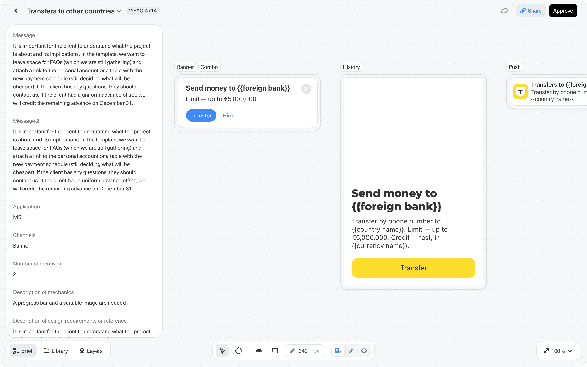

*Editor workspace - the brief stays visible beside Banner, History, and Push previews, so the role can work without jumping back to Jira or docs.*

## Problem

- Campaign content production was split across tools: Jira, chats, Figma, Google Docs, content constructors, and launch systems.
- Editors, designers, and technologists had different jobs, but they were working on the same creative artifact and repeatedly reassembled context for each handoff.
- Review history and decision-making were hard to audit because comments, versions, references, and approvals lived outside the creative.
- Template and asset reuse was weak: previous creatives, styles, images, icons, videos, and mechanics could not reliably become the starting point for the next campaign.
- AI generation had promise, but teams were clear that it should support specialists rather than replace editorial, design, or technical judgment.

## Approach

I treated the meetings as a validation loop for a product vision, not as a final feature pitch. The concept was shown separately to role groups - Editors, Designers, and Technologists - and then debated with product and architecture stakeholders.

The key alignment point was not "everyone uses the same screen." It was "each participant can complete their job in one coherent place." Editors need message quality, facts, tone, variants, and optional customer review. Designers need visual control, libraries, resizing, layers, templates, and Figma import. Technologists need JSON, substitutions, actions, deeplinks, triggers, test groups, and bulk testing. The product direction became a shared canvas with role-specific modes rather than a generic all-in-one editor.

## Solution

The proposed Content Hub workspace has one canvas and several role modes. A campaign can pre-create the needed creative shells from the brief and scenario, then route them through content, design, layout, approval, and testing.

**1. Shared campaign context** - Every role starts from the same source: campaign brief, audience, hypothesis, A/B test logic, selected channels, creative requirements, generated drafts, comments, and status.

<!-- FIGURE: `Editors/02.png` - editor fields and apply-to-all. -->

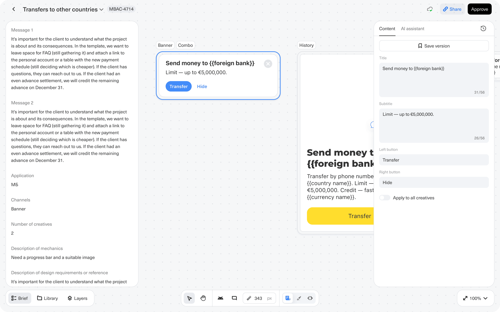

*Editor mode - role-specific fields for title, subtitle, and buttons, with an option to apply text changes across selected creatives.*

**2. Editor mode** - Editors work with copy fields directly on creative previews, save versions, compare alternatives, use an AI assistant for variants, and optionally share a read-only/commenting view when customer or partner review is needed. The meetings refined an important rule: customer re-approval should be optional, not a mandatory loop for every AI-assisted text.

<!-- FIGURE: `Editors/03.png` - AI text variants and version history. -->

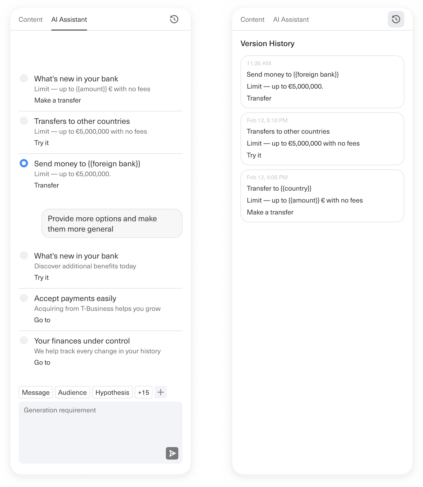

*AI assistant and version history - generated message variants are preserved so teams can compare options instead of losing drafts in chat threads.*

<!-- FIGURE: `Editors/04.png` - comments on creative preview. -->

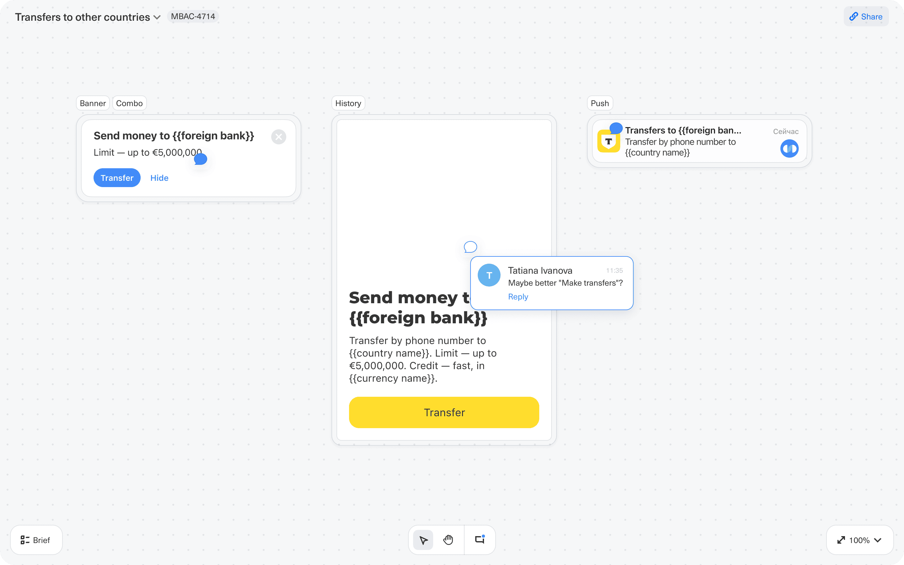

*Commenting mode - reviewers can leave feedback directly on the creative, keeping discussion attached to the artifact.*

**3. Designer mode** - Designers can edit visual composition, tune backgrounds, manage layers, use a project library, reuse styles and templates, and resize assets across formats. The concept keeps Figma as an escape hatch for custom work: designers can import finished work instead of forcing every task into the built-in editor.

<!-- FIGURE: `Designers/01.png` - designer content controls. -->

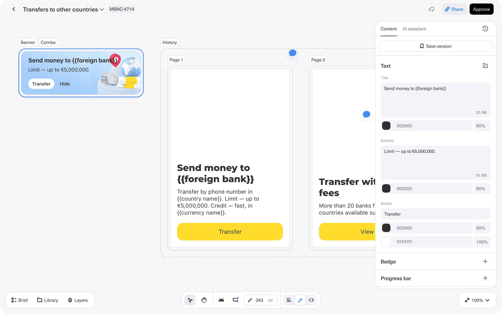

*Designer mode - visual editing happens beside the same creative previews and approval controls used by the rest of the flow.*

<!-- FIGURE: `Designers/02.png` - library and templates. -->

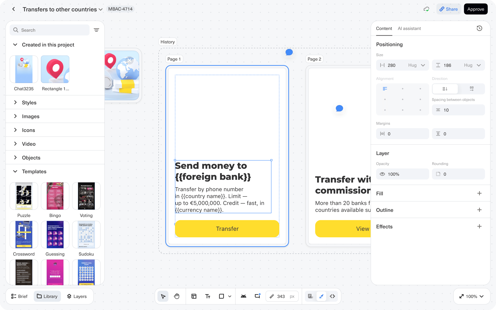

*Library - generated and uploaded assets, styles, images, videos, objects, and templates can be reused inside the next creative.*

<!-- FIGURE: `Designers/03.png` - layers. -->

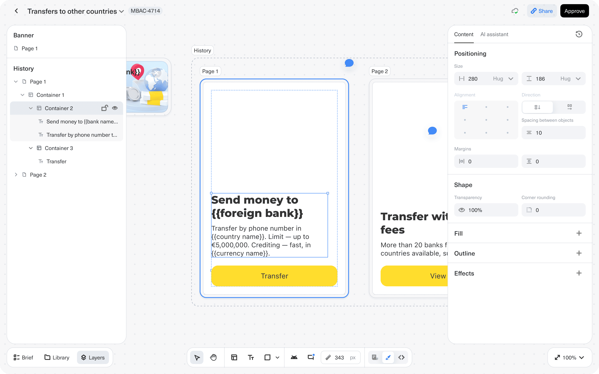

*Layers - complex formats such as stories can expose pages, containers, text, and buttons as editable structure instead of a flat screenshot.*

<!-- FIGURE: `Designers/04.png` - AI assistant for image generation. -->

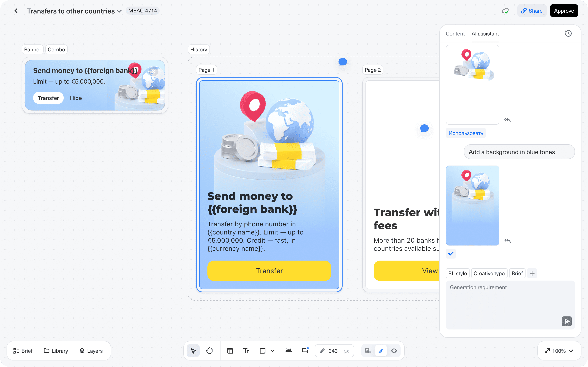

*Designer AI assistant - image generation is positioned as a helper for exploration, refinement, and resizing, not as an automatic replacement for design review.*

**4. Technologist mode** - Technologists inherit the same creative package, then add personalization, substitutions, actions, deeplinks, navigation, triggers, and JSON-level checks. This mode is optimized for the technical finishing work that still needs human control.

<!-- FIGURE: `Technologists/01.png` - personalization and deeplink setup. -->

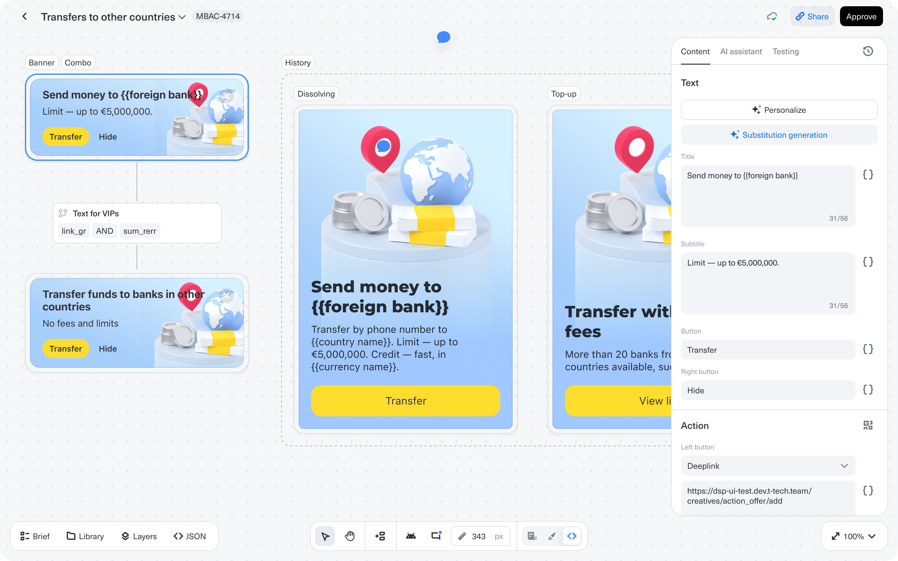

*Technologist mode - substitutions, personalization, and action setup are attached to the same creative preview.*

<!-- FIGURE: `Technologists/02.png` - JSON view. -->

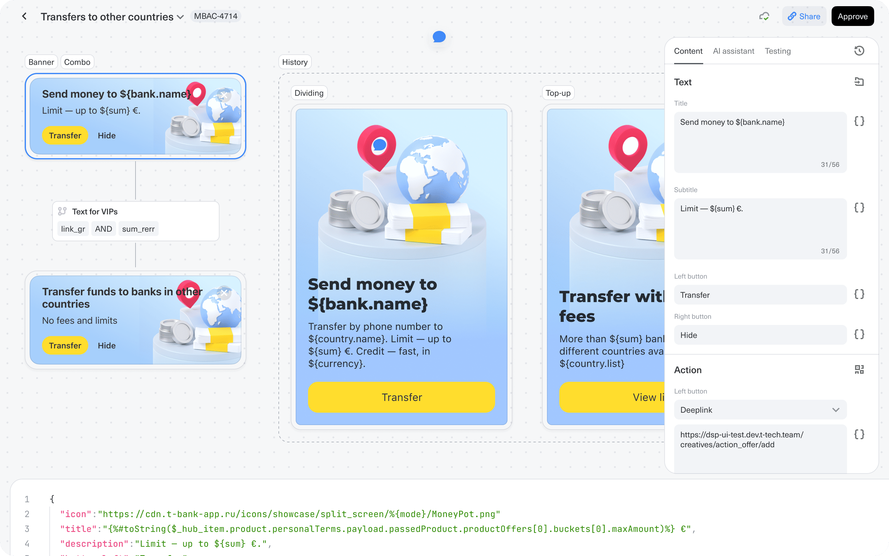

*JSON view - technologists can inspect the underlying structure when a creative needs deeper technical control.*

<!-- FIGURE: `Technologists/03.png` - navigation actions. -->

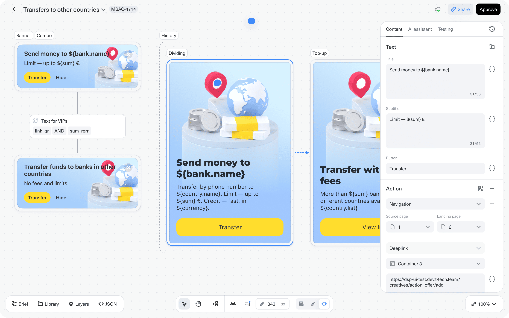

*Action setup - page navigation and deeplinks can be configured without leaving the creative workspace.*

<!-- FIGURE: `Technologists/04.png` - testing setup. -->

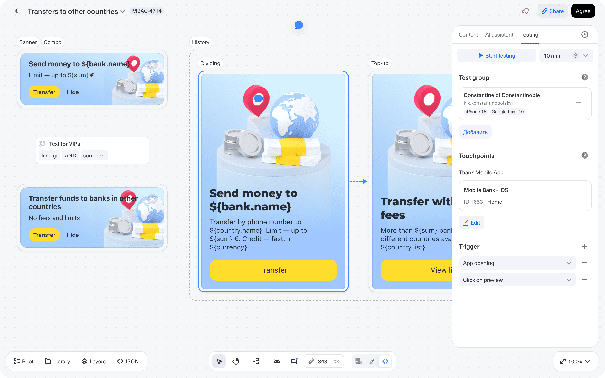

*Testing mode - one panel configures test group, touchpoints, app triggers, and launch conditions for the selected creative set.*

**5. Content memory** - Once creatives are built, their assets, templates, revisions, generated variants, comments, approval state, campaign linkage, and performance metadata become part of the Content Hub. This turns production artifacts into reusable product data.

## Impact

The work produced a shared vision for how content production should live inside Touch: not as another isolated tool, but as the campaign's content memory and production workspace.

The validation sessions surfaced concrete product decisions: keep role-specific modes, make AI assistive, preserve Figma import for custom work, support optional external review, plan for role permissions, and test the product with real users before launch. The biggest unresolved risk is product architecture: the UX vision depends on a strong content data model, versioning, template strategy, and integrations with existing systems during the transition period.

## Learnings

- A "single workspace" only works when each role still gets its own focused job surface.
- AI should remove repetitive production work - variants, substitutions, resize support, checks - but should not bypass specialist accountability.
- Vision work needs a technical counterpart early. The meetings made the UX target clearer, but also exposed where data model, roles, template architecture, and testing workflows need deeper design.

## Assets in this folder

| File | What it shows | Use on case page |
|------|---------------|------------------|
| `00 oreview.png` | Shared canvas with AI assistant and approval controls | **Hero** |
| `Editors/01.png` | Brief beside creative previews | **Overview** |
| `Editors/02.png` | Editor text fields and apply-to-all | **Solution - Editor mode** |
| `Editors/03.png` | AI-generated copy variants and version history | **Solution - Editor mode** |
| `Editors/04.png` | Anchored comments on creative preview | **Solution - Editor mode** |
| `Designers/01.png` | Designer properties panel | **Solution - Designer mode** |
| `Designers/02.png` | Library with assets, styles, images, videos, objects, templates | **Solution - Designer mode** |
| `Designers/03.png` | Layers panel for structured creative pages | **Solution - Designer mode** |
| `Designers/04.png` | AI assistant for image refinement | **Solution - Designer mode** |
| `Technologists/01.png` | Substitutions and deeplink setup | **Solution - Technologist mode** |
| `Technologists/02.png` | JSON view | **Solution - Technologist mode** |
| `Technologists/03.png` | Navigation/action setup | **Solution - Technologist mode** |
| `Technologists/04.png` | Testing panel | **Solution - Technologist mode** |

## Publishing checklist

- [x] Lead stands alone if someone only reads one sentence
- [x] Snapshot has Task + Goal + Role; Metrics or honest "vision stage"
- [x] At least one figure between Overview and Solution (`Editors/01.png`)
- [x] Problem bullets are specific, not generic
- [x] Solution references what is visible in the screenshots
