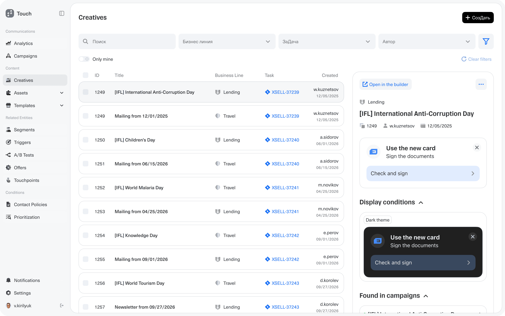
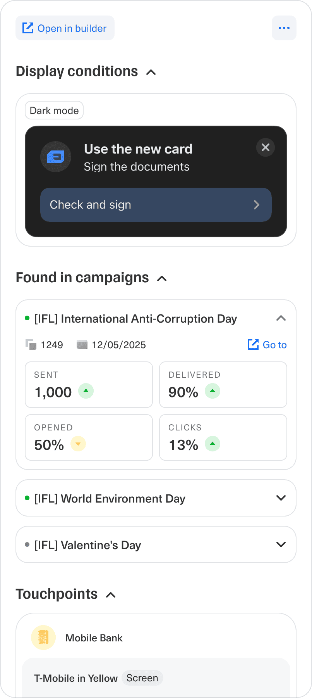
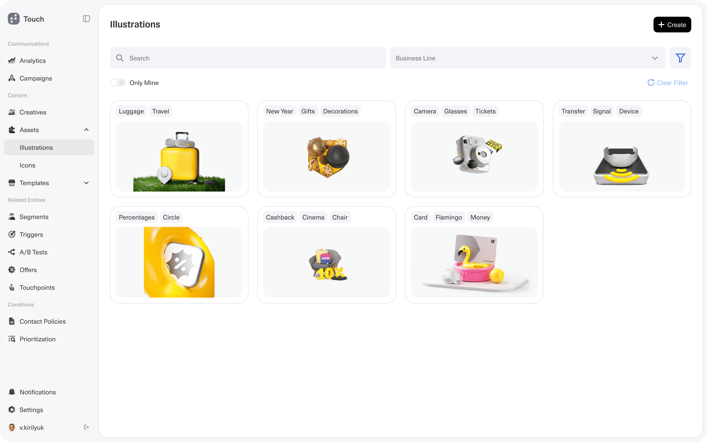
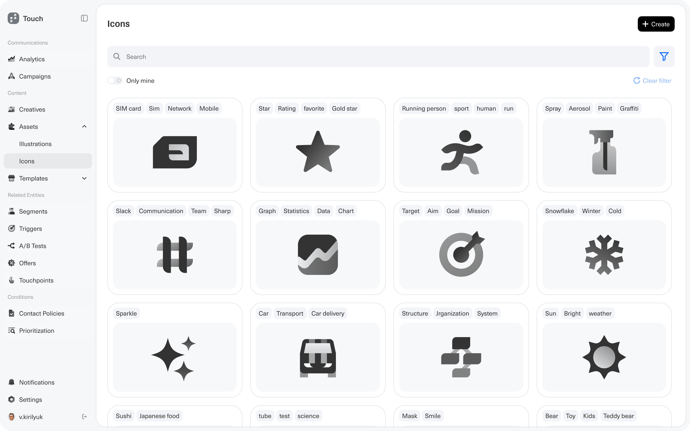
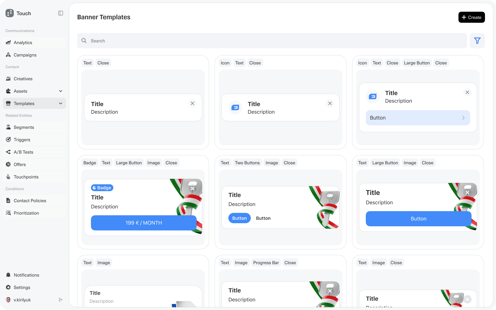

# Touch — Content storage

> Source content for [`../../../projects/content-storage.html`](../../../projects/content-storage.html). Structure follows [`../../../project-page-structure.md`](../../../project-page-structure.md). Slug: `content-storage`.

**Client · Domain · Type · Years:** Tinkoff · FinTech · Marketing automation · Web app · 2026

**Lead:** Designed the storage layer for Touch's content platform: a searchable content memory where teams can find creatives, assets, icons, and templates, understand where each item is used, and reuse proven content without losing campaign history, metadata, or performance context.

<!-- FIGURE: Hero - use `00 Preview.png`. Illustration library with search, filters, tags, and reusable assets. -->

*Content Storage - reusable illustrations are organized with tags, business-line filters, ownership, and creation controls.*

## Highlights snapshot

| Label | Value |
|-------|-------|
| **◆ Context** | Touch - internal CVM / marketing automation platform for financial services |
| **◆ Task** | Define how Content Hub stores, finds, reuses, and audits campaign creatives and their building blocks |
| **◆ Goal** | Reduce duplicated production work and make every creative traceable: where it came from, where it is used, how it performs, and which assets or templates can be reused |
| **◆ Constraints** | Regulated financial communications; many content types; theme and localization changes; legacy JSON/template logic; separate production roles; need to integrate with Touch campaigns instead of becoming a disconnected DAM |
| **◆ Role** | Product Design Lead - UX architecture, information model, visual concept, stakeholder alignment, critique synthesis |
| **◆ Team** | Product, engineering, content platform, marketing operations, designers, editors, technologists |
| **◆ Scope** | Creative registry, asset libraries, icon storage, banner templates, metadata, tags, campaign usage, touchpoints, performance preview, builder entry point |
| **◆ Metrics** | _Vision stage - expected impact: less duplicated layout work, faster asset reuse, clearer audit trail, stronger foundation for analytics and future generation._ |
| **◆ Status** | Vision / discovery |
| **◆ Tools** | Figma, stakeholder syncs, meeting transcript analysis |

## Designers

| Name | Role | Avatar |
|------|------|--------|
| Vova Kirilyuk | Product Design Lead | `../../team/Vova.png` |
| Alex | Co-designer | `../../team/Alex.png` |

## Overview

Content storage is the library layer of Touch's content platform. If the Content Hub canvas is where campaign creatives are produced, storage is where those creatives become reusable product data: published cards, illustrations, icons, templates, metadata, usage history, and performance signals.

The meeting around the wider Content Hub vision made this layer especially important. Stakeholders aligned on the value of one coherent content memory, but challenged the idea that every job should happen in one universal workspace. The stronger product direction was to keep storage as the source of truth: Touch campaigns can use it seamlessly, while editors, designers, technologists, and platform teams still get the right surfaces for their own work.

<!-- FIGURE: `01.png` - creative registry with detail panel. -->

*Creative registry - each creative has ownership, business-line metadata, a source task, builder access, display conditions, usage in campaigns, metrics, and touchpoints.*

## Problem

- Campaign teams reused content by cloning tasks, copying JSON, searching chats, or asking the same specialists where an asset came from.
- A creative could be live in multiple campaigns, but its usage, performance, touchpoints, conditions, and source task were not visible in one place.
- Assets, icons, and templates were treated as files or implementation details rather than managed objects with tags, ownership, metadata, and reuse paths.
- Template strategy was contested: teams needed faster reuse, but architecture stakeholders warned against inventing separate template entities when branching/revision logic might solve the same problem more cleanly.
- Future requirements - dark and light themes, localization, content variants, analytics identifiers, and immutable publication history - required a stronger data model than a simple visual gallery.

## Approach

I separated the vision into two questions: what the user sees when they need to find or reuse content, and what the platform must remember so the same content can be audited, branched, measured, and adapted later.

The transcript was useful because it exposed the real tension. Product and UX stakeholders wanted a seamless campaign flow in Touch. Architecture stakeholders pushed for a master content system with revisions, immutable identifiers, plugin-like extensibility, and fewer unnecessary entities. The storage concept became the bridge: a user-facing library that looks simple, but is organized around the platform primitives that make reuse and analytics possible.

## Solution

The proposed Content Storage experience is organized around four object types: creatives, assets, icons, and templates. Each type has lightweight browsing, search, tags, ownership filters, and a clear route back into campaign production.

**1. Creative registry** - Creatives are listed as durable objects, not screenshots. The table exposes ID, title, business line, task, author, and creation date. Selecting a creative opens a detail panel with builder access, display conditions, campaign usage, performance cards, and touchpoints.

<!-- FIGURE: `02.png` - detail panel with display conditions, campaigns, metrics, and touchpoints. -->

*Creative detail - one panel answers "where is this used?", "under which conditions?", "how did it perform?", and "which touchpoints show it?"*

**2. Asset library** - Illustrations and other generated or uploaded assets are stored with semantic tags and business-line filters. The goal is to make reuse intentional: a designer can find a proven visual direction instead of recreating it or asking where a previous asset lives.

<!-- FIGURE: `03.png` - illustration library. -->

*Illustration library - generated and uploaded visuals become searchable assets, enriched by tags and campaign context.*

**3. Icon storage** - Icons get the same library treatment as larger assets. This matters for production quality because small primitives are reused across cards, templates, themes, and mechanics.

<!-- FIGURE: `04.png` - icon library. -->

*Icon library - content primitives such as SIM, rating, sport, target, weather, and system icons are stored as reusable building blocks.*

**4. Template catalog** - Banner templates are presented as reusable starting points with visible structure: text, icons, buttons, badges, images, progress bars, and close controls. The concept keeps the UX benefit of templates while leaving room for the architectural decision from the meeting: templates may become their own managed objects, or they may be expressed as favorite/branched creatives with revision history.

<!-- FIGURE: `05.png` - banner template catalog. -->

*Template catalog - teams can start from proven layouts instead of rebuilding common banner mechanics from scratch.*

**5. Content memory** - The most important design decision is that storage is not only a gallery. Each item can carry campaign links, source task, authorship, display conditions, touchpoints, publication identifiers, revision history, and performance signals. That makes Content Storage useful for production teams today and for future automation, analytics, and AI-assisted generation later.

## Impact

The work reframed Content Hub from a production editor into a broader content system. The storage layer gives the vision a durable foundation: every creative and asset can be discovered, reused, audited, and connected back to campaign outcomes.

It also turned a tense stakeholder debate into clearer product questions: which jobs must be seamless inside Touch, which tools should remain specialized, how much of "templates" should be a UX concept versus a data-model concept, and which metadata is mandatory before analytics and automation can be trusted.

## Learnings

- A content library becomes valuable when it stores context, not just files.
- Reuse needs a data model as much as a UI: revisions, branches, tags, ownership, conditions, identifiers, and usage history shape the product.
- Vision work is stronger when disagreement is captured as product risk. The meeting showed exactly where UX, architecture, and roadmap planning needed to converge.

## Assets in this folder

| File | What it shows | Use on case page |
|------|---------------|------------------|
| `00 Preview.png` | Illustration library with search, filters, tags, and reusable assets | **Hero** |
| `01.png` | Creative registry and selected creative detail panel | **Overview / Solution - Creative registry** |
| `02.png` | Display conditions, campaign usage, metrics, and touchpoints | **Solution - Creative registry** |
| `03.png` | Illustration library | **Solution - Asset library** |
| `04.png` | Icon library | **Solution - Icon storage** |
| `05.png` | Banner template catalog | **Solution - Template catalog** |

## Publishing checklist

- [x] Lead stands alone if someone only reads one sentence
- [x] Snapshot has Task + Goal + Role; Metrics or honest "vision stage"
- [x] At least one figure between Overview and Solution (`01.png`)
- [x] Problem bullets are specific, not generic
- [x] Solution references what is visible in the screenshots
