# Touch — Campaign Creation Flow

> Source content for [`../../../projects/touch-campaign-flow.html`](../../../projects/touch-campaign-flow.html). Structure follows [`../../../project-page-structure.md`](../../../project-page-structure.md). Slug: `touch-campaign-flow`.

**Client · Domain · Type · Years:** Tinkoff · FinTech · Marketing automation · Web app · 2022–Present

**Lead:** Designed an end-to-end campaign creation flow in Touch that lets marketing managers build, configure, and publish multi-channel communication campaigns — with A/B testing and approval routing in one unified interface.

<!-- FIGURE: Hero — use `00 Preview.png` (export as touch-campaign-flow.png + @2x for home card and case page) -->

*Scenario canvas — node-based flow from launch schedule through audience checks to a four-way A/B split (Control, Shopping, Static Regulation, Motion Regulation).*

## Highlights snapshot

| Label | Value |
|-------|-------|
| **◆ Context** | Touch — internal CVM / marketing automation platform for financial services |
| **◆ Task** | Design the end-to-end campaign creation journey: setup, audiences, content, and scenario orchestration |
| **◆ Goal** | Reduce campaign time-to-launch by centralizing targeting, creative production, A/B configuration, and approvals |
| **◆ Constraints** | Multi-role creative approval gates (Editor, Designer, Technologist); 7+ channel formats; regulated financial services context |
| **◆ Role** | Lead Product Designer — UX/UI, flow architecture, creative builder, scenario canvas |
| **◆ Team** | PM, marketing managers, engineering, content platform, data |
| **◆ Scope** | 4-stage wizard (About → Audiences → Content → Scenarios), creative builder with AI generation, visual scenario canvas with A/B splits |
| **◆ Metrics** | _NDA — directional: fewer tool handoffs, single interface from brief to publish._ |
| **◆ Status** | Shipped |
| **◆ Tools** | Figma |

## Designers

| Name | Role | Avatar |
|------|------|--------|
| Vova Kirilyuk | Lead designer | `../../team/Vova.png` |
| Alex | Co-designer | `../../team/Alex.png` |
| Rita | Co-designer | `../../team/Rita.png` |
| Serge | Co-designer | `../../team/Serge.png` |

## Overview

Touch is an internal CVM and marketing automation platform used by marketing managers at a financial services company. Campaigns like *Exclusive Rewards Program for Small Business Car Insurance* need coordinated audience targeting, multi-channel creatives, A/B test configuration, and compliance-aware approval — work that previously scattered across disconnected tools.

I designed a structured four-stage creation flow — **About → Audiences → Content → Scenarios** — that carries a campaign from metadata and hypothesis through audience attachment, creative production, and visual scenario orchestration. AI-assisted analysis and generation, multi-role approval routing, and a node-based canvas with first-class A/B testing are embedded in the journey rather than bolted on as separate settings.

<!-- FIGURE: `01.png` — place after Overview (first figure between Overview and Solution per publishing checklist). Campaigns hub: list view, statuses, "+ Create" entry point. Establishes where the flow lives inside Touch before diving into the four stages. -->

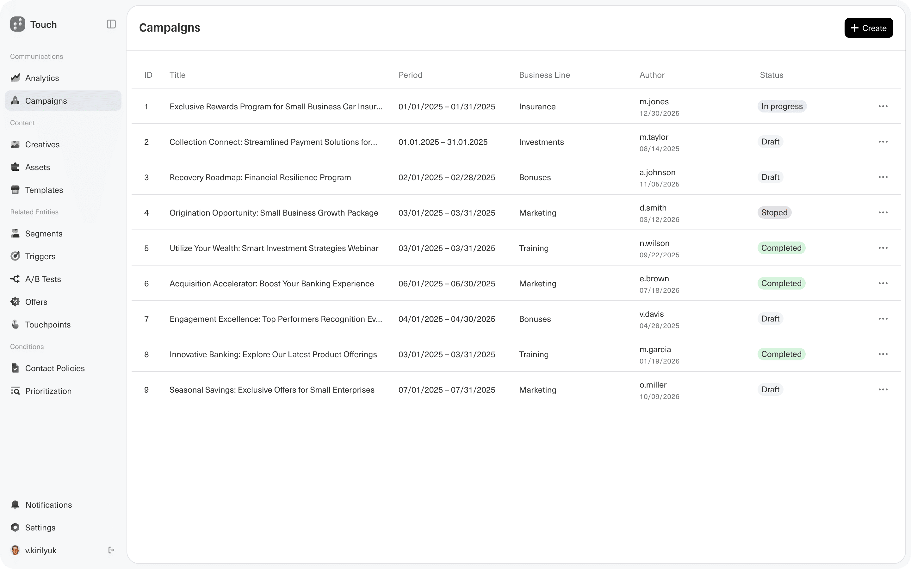

*Campaigns hub — entry point to the creation flow; the case campaign (*Exclusive Rewards Program for Small Business Car Insurance*) shown in progress.*

## Problem

- Marketing managers stitched together audience tools, creative builders, and send orchestration across disconnected systems — each handoff added delay and context loss.
- Multi-channel campaigns (Push, SMS, Email, In-App, Banner, etc.) required repeating setup work per channel instead of configuring from one canvas.
- A/B testing lived outside the main workflow, making split configuration and branch-level communication mapping cumbersome.
- Creative approval (Editor, Designer, Technologist) was decoupled from the builder, so review cycles restarted when content changed mid-flow.

## Solution

A top-navigated wizard anchors the journey; each stage owns a distinct job while sharing context with the stages that follow.

**1. Campaign Setup (About)** — Metadata capture: type (Promotion), business line (Insurance), team, hypothesis, risks, and business value. A right-side panel surfaces an AI-powered Analysis module plus links to an Approval workflow and a visual Board.

<!-- FIGURE: `02.png` — Campaign Setup (About). Shows four-stage top nav, metadata form (type, period, business line, hypothesis, risks, business value), A/B test toggle on About, and right rail: Analysis ✓, Approval link, Board thumbnail. -->

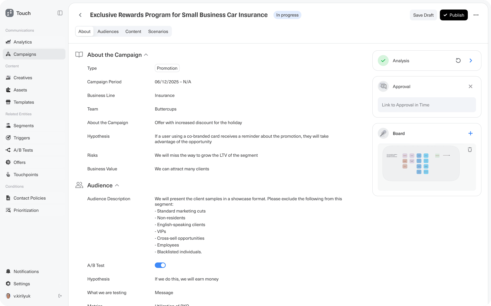

*About — campaign metadata, hypothesis, and right-rail widgets (Analysis, Approval, Board).*

**2. Audience Configuration** — Audiences are assembled and attached to the campaign. Each entry (e.g. *Company Employees*, ID 63912) shows volume (350,000 users), tags, business key, and exportable parameters. Segments drill deeper via T-segments integration.

<!-- FIGURE: `03.png` — Audience Configuration. Audiences table (Company Employees 63912 selected), right panel: description, tags, volume 350,000, business key SIEBEL, "Go to T-segments", exportable parameters. -->

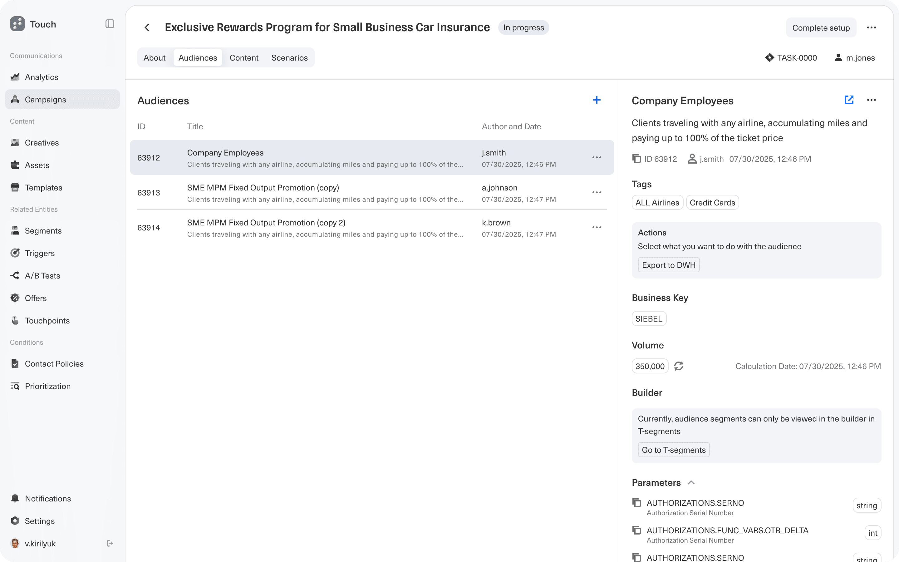

*Audiences — attached segments with volume, tags, T-segments link, and exportable parameters.*

**3. Content & Creatives** — Creatives are authored or AI-generated in the builder. Supported formats: **Push, SMS, Chat, Email, In-App Message, Banner, Bottom Sheet, and History**. Creatives pass through a multi-role approval gate before activation.

<!-- FIGURE: `04.png` — Content list view. Creatives table (Banner · Combo, Push, History) with Approval status; right panel: "Requires approval" (Editor, Designer, Technologist) + banner preview with `{{foreign bank}}`. Best for multi-channel list + approval gate. -->

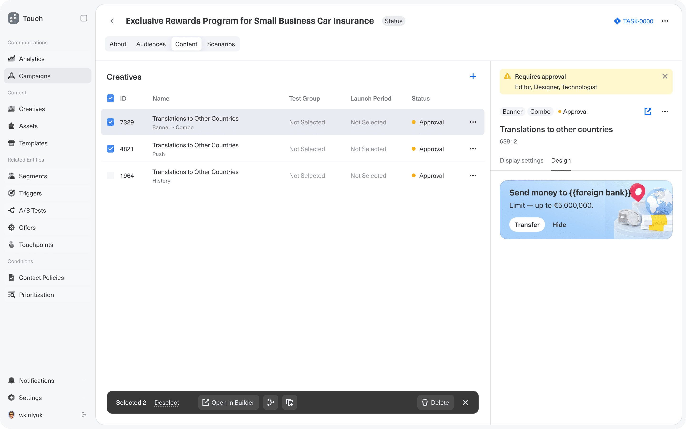

*Content — multi-channel creatives in one list; approval gate surfaces required roles before activation.*

<!-- FIGURE: `11.png` — optional second figure for §3 OR pair with §4. Canvas context: Push + Banner nodes with "Under review" badges; right properties panel for inline Banner editing (title/subtitle/button, char counts) + approval alert (Copywriter, Designer, Technologist). Shows approval + editing without leaving the scenario. -->

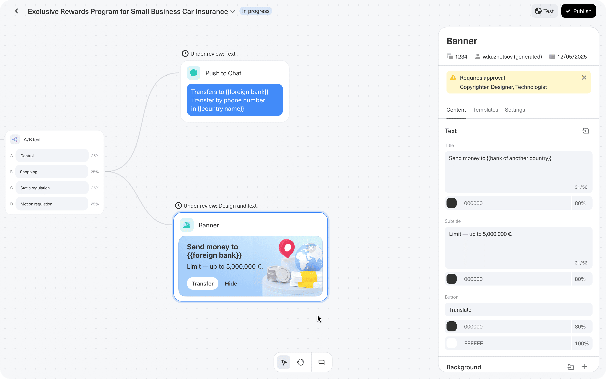

*Creative editing on canvas — properties panel, dynamic variables, and per-node approval status.*

**4. Scenario Builder (Visual Canvas)** — A node-based flow editor connects Launch Schedule → Audience → Communication Check → Audience Size Limitation → A/B Test. The A/B node splits into Control, Shopping, Static Regulation, and Motion Regulation (25% each); each branch wires to channel-specific communication nodes. Components drag in from a left-side panel; multi-channel selection opens in a single modal to keep the canvas uncluttered.

<!-- FIGURE: `05.png` — Scenarios list/management view (before opening canvas). Scenario groups table, right panel: linked audience, A/B test name, communications list (Push, SMS), automated actions. Use before canvas shots to show the organizational layer. -->

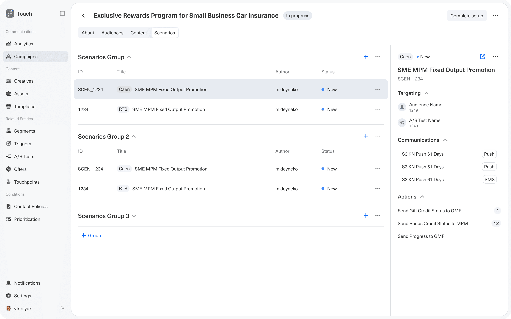

*Scenarios — group management with audience, A/B test, channel, and action linkage in the detail panel.*

<!-- FIGURE: `06.png` — Full canvas overview (alternate to hero if you want a wider sidebar). Same flow as 00 Preview but in-page; left component palette (Segmentation + Communication channels). Primary figure for §4 body copy. -->

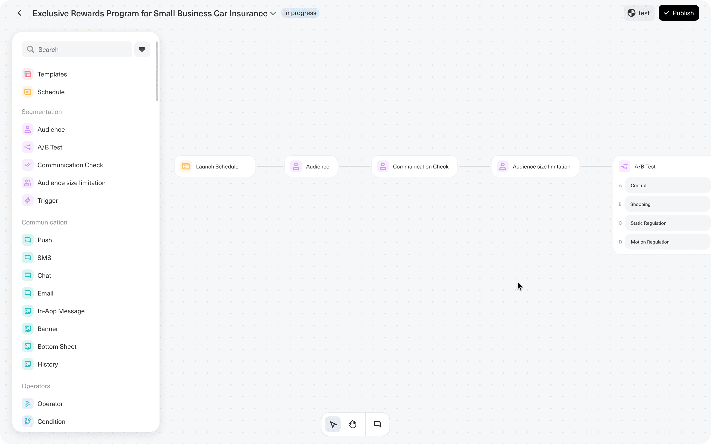

*Scenario canvas — drag-and-drop palette and linear flow into a four-way A/B test.*

<!-- FIGURE: `07.png` — Multi-channel modal, step 1. User drags from A/B branch; "Select Communication Types" modal opens with all 8 channels. Supports Learnings bullet on single-modal channel picker. -->

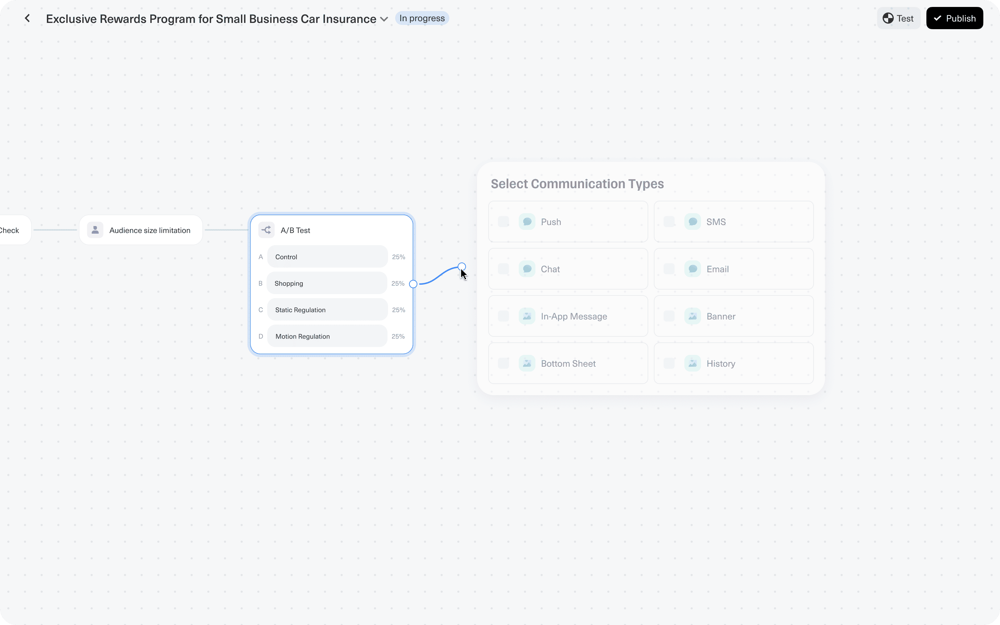

*Connecting an A/B branch — channel selection opens in a modal instead of cluttering the canvas.*

<!-- FIGURE: `08.png` — Multi-channel modal, step 2. Push + Banner selected; Cancel / Next. Pair with 07 as a two-step sequence or use 08 alone. -->

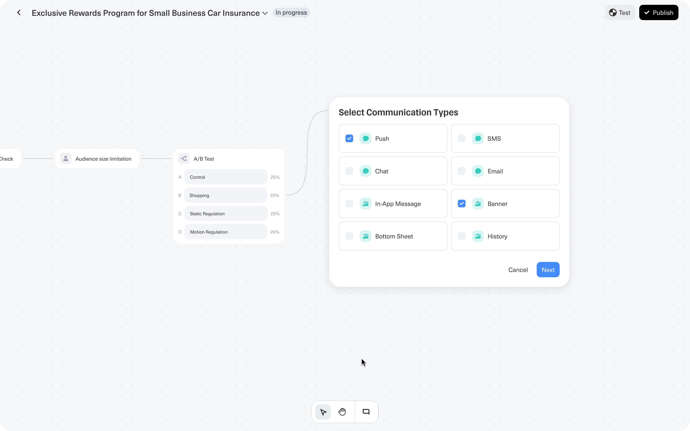

*Channel picker — Push and Banner selected before wiring nodes on the branch.*

**Creative builder detail** — Marketers configure banner messages with dynamic variables (e.g. `{{foreign bank}}`), select required UI elements (Badge, Two Buttons, Image, Icon, Progress Bar), describe image assets for AI generation, and attach reference files. A **Collect Creatives** action bundles everything for review.

<!-- FIGURE: `09.png` — Creative builder modal ("Almost Ready!"). Banner/Push tabs, message copy, Required elements (Two Buttons, Image checked), AI image prompt ("Describe the image"), reference attachments, Collect creatives CTA. Canvas shows A/B test in background. Primary figure for Creative builder detail + Learnings (AI generation). -->

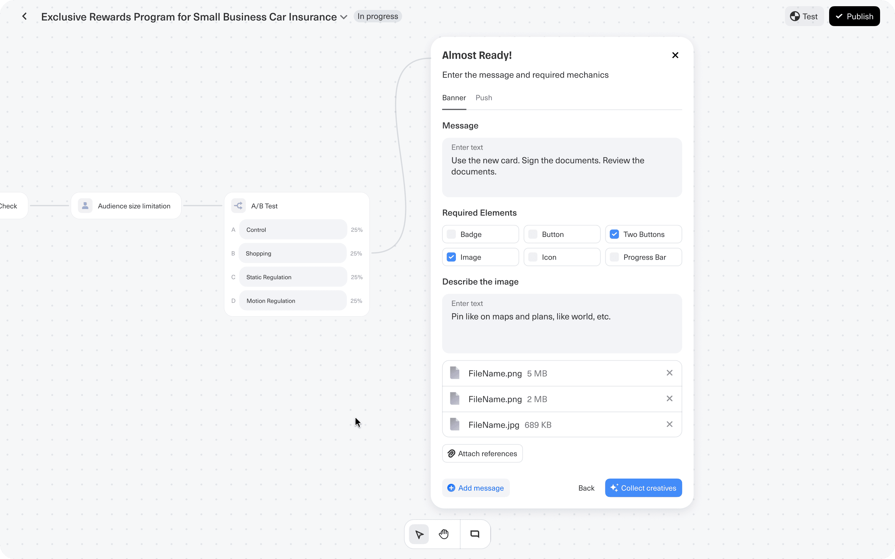

*In-flow creative builder — UI element checkboxes, AI image prompt, reference files, and Collect creatives.*

<!-- FIGURE: `10.png` — Completed scenario wiring. A/B branches connected to Push to Chat + Banner nodes; Refine / Generate again / Save on the creative container. Best payoff shot for §4 + Learnings (AI embedded in creative step, A/B as first-class node). Consider as second hero candidate or closing figure before Impact. -->

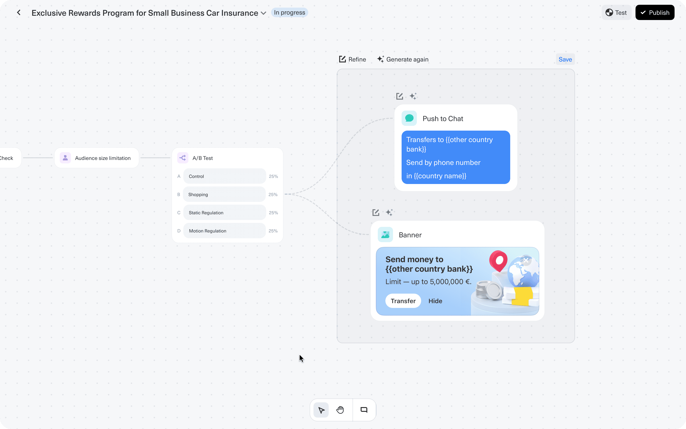

*Wired scenario — A/B branches mapped to Push and Banner; Refine and Generate again inline on the canvas.*

## Impact

The flow reduces campaign time-to-launch by centralizing audience targeting, creative production, A/B test configuration, and approval routing into a single unified interface — eliminating handoffs between disconnected tools.

## Assets in this folder

| File | What it shows | Use on case page |
|------|---------------|------------------|
| `00 Preview.png` | Scenario canvas — full flow to A/B split, left component palette | **Hero** + home card (`touch-campaign-flow.png` / `@2x`) |
| `01.png` | Campaigns hub — list, statuses, "+ Create" | **Overview** — platform context (first in-story figure) |
| `02.png` | About tab — metadata, hypothesis, Analysis / Approval / Board rail | **Solution §1** — Campaign Setup |
| `03.png` | Audiences tab — segment list, volume 350k, T-segments | **Solution §2** — Audience Configuration |
| `04.png` | Content tab — creatives list, approval roles, banner preview | **Solution §3** — Content list + approval gate |
| `05.png` | Scenarios tab — groups list, linked comms and actions | **Solution §4** — scenario management (pre-canvas) |
| `06.png` | Scenario canvas — palette + linear flow to A/B | **Solution §4** — canvas overview (in-page; similar to hero) |
| `07.png` | Canvas + "Select Communication Types" modal (empty selection) | **Solution §4** / **Learnings** — modal channel picker |
| `08.png` | Same modal — Push + Banner selected, Next | **Solution §4** — pair with `07` or use alone |
| `09.png` | "Almost Ready!" builder — AI prompt, elements, Collect creatives | **Creative builder detail** + **Learnings** (AI) |
| `10.png` | Wired canvas — Push + Banner on A/B branches, Refine / Generate again | **Solution §4** payoff + **Learnings** (AI on canvas) |
| `11.png` | Canvas editing — properties panel, Under review, approval alert | **Solution §3 or §4** — inline edit + approval on canvas |

**Suggested page order (12 figures → trim to 6–8 for readability):** Hero (`00`) → Overview (`01`) → About (`02`) → Audiences (`03`) → Content (`04`) → Scenarios list (`05`) → Canvas (`06`) → Modal (`07` or `08`) → Builder (`09`) → Payoff (`10`). Skip or merge `11` if `04` + `10` already cover approval; keep `11` if you want the properties-panel editing story.

## Publishing checklist

- [ ] Lead stands alone if someone only reads one sentence
- [ ] Snapshot has Task + Goal + Role; Metrics or honest "no public numbers"
- [x] At least one figure between Overview and Solution (`01.png`)
- [ ] Problem bullets are specific, not generic
- [ ] Solution references what's visible in the screenshot
