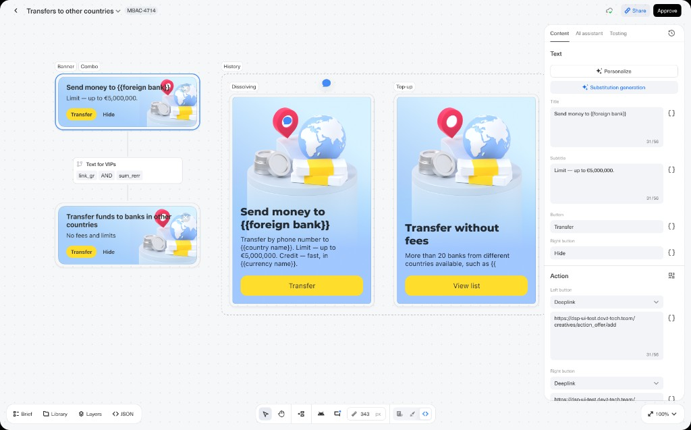

# Transfers to other countries

> Source content for [`../../../projects/transfers-abroad.html`](../../../projects/transfers-abroad.html). Structure follows [`../../../project-page-structure.md`](../../../project-page-structure.md).

**Client · Domain · Type · Years:** Tinkoff · FinTech · In-app marketing · 2024–2025

**Lead:** Designed a family of in-app promotional cards that explain international transfers, surface limits and fee-free options, and drive users into the transfer flow via deeplinks.

*Card variants — Banner, Combo, History, Dissolving, Top-up — with CMS-driven copy and deeplink actions.*

## Highlights snapshot

| Label | Value |
|-------|-------|
| **◆ Context** | In-app feed cards, mobile banking |
| **◆ Task** | Design a modular system of promo cards for international transfers |
| **◆ Goal** | Users understand limits, speed, and fees before tapping Transfer |
| **◆ Constraints** | Strict CMS character budgets (e.g. title 31/56), deeplink-only CTAs, no net-new flows |
| **◆ Role** | Lead Product Designer — UX/UI, copy structure, illustration direction, handoff |
| **◆ Team** | PM, marketing, engineering, in-app content platform |
| **◆ Scope** | 5 card variants (Banner, Combo, History, Dissolving, Top-up), illustration direction, A/B-ready copy |
| **◆ Metrics** | _NDA — fill in directional wins or “shipped to 100% MAU” once cleared._ |
| **◆ Status** | Shipped |
| **◆ Tools** | Figma, in-app CMS |

## Overview

The mobile banking app needed clear, trustworthy touchpoints for a high-stakes product: sending money to foreign banks. Users had to understand limits, speed, fees, and supported destinations before tapping through to the transfer flow.

I designed a modular card system for the in-app feed: compact banners for quick actions, richer combo cards with illustration and primary CTA, and supporting patterns for history and top-up contexts. Copy is templated with placeholders — `{{foreign bank}}`, `{{country name}}`, `{{currency name}}` — so marketing can localize and personalize at scale without redesigning layouts.

## Problem

- International transfers are complex; users need confidence about limits, fees, and delivery before committing.
- Multiple propositions compete in the same surface: phone-number transfers, fee-free corridors, and high limits (up to €5,000,000).
- Content must stay consistent across card types while fitting strict character limits in the CMS.

## Solution

A shared visual language — light blue surfaces, 3D globe-and-cash illustration, yellow primary buttons — ties every variant together. Each format optimizes for its placement:

- **Banner** — horizontal strip with headline, limit line, Transfer + Hide actions for persistent feed slots.
- **Combo / Dissolving** — full card with illustration, body copy, and a single primary deeplink (Transfer or View list).
- **History / Top-up** — contextual reuse of the same components when the user is reviewing past transfers or funding a wallet.

Actions are configured as deeplinks into the transfer and bank-list flows, with character budgets enforced in the content editor (e.g. title 31/56) so copy never breaks the layout.

Key value props surfaced in the UI across variants:

- Transfer by phone number to supported countries
- High limits — up to €5,000,000 where applicable
- Fast credit in the recipient’s currency
- Fee-free transfers to 20+ partner banks across regions
- Clear secondary path to browse the full bank list

## Impact

_Add measurable outcomes here when available — tap-through delta, support-ticket reduction, A/B results. If NDA, keep directional language ("shipped to 100% MAU", "A/B winner", "5 variants live in CMS")._

## Learnings

_Optional 2–3 bullets in a lead-level voice. Drafts:_

- Templated copy + character budgets in the CMS removed an entire layout-rework cycle per campaign.
- Shared illustration system across variants kept the feed feeling like one product, even with five card formats.

## Assets in this folder

- `transfers-abroad.png` — composite of card variants (1024w, used on home card and case figure)
- `transfers-abroad@2x.png` — 2× version (2048w) for retina/srcset

## Publishing checklist

- [ ] Lead stands alone if someone only reads one sentence
- [ ] Snapshot has Task + Goal + Role; Metrics or honest “no public numbers”
- [ ] At least one figure between Overview and Solution
- [ ] Problem bullets are specific, not generic
- [ ] Solution references what’s visible in the screenshot
